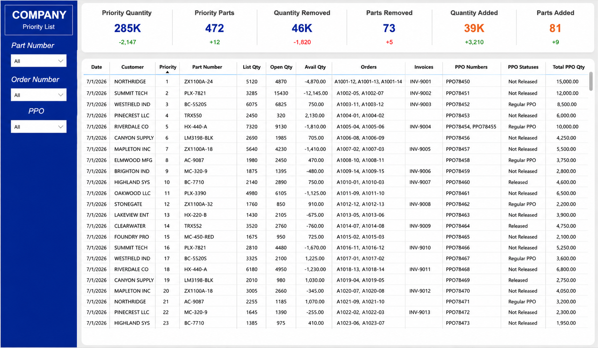

# 📊 Customer Priority Dashboard

An interactive Power BI dashboard I built to help manufacturing teams prioritize customer demand using inventory availability, purchase orders, and open sales orders.

> **Note:** All data included in this project is fictional and was created for portfolio purposes. No proprietary or company data is included.




---

# Why I Built This

Manufacturing planners often have to review multiple reports before deciding which customer orders should be prioritized. Inventory shortages, purchase orders, and open demand are frequently spread across different systems, making production planning more time consuming than it needs to be.

I built this dashboard to consolidate that information into a single operational view, allowing planners to quickly identify priority orders, inventory constraints, and purchase order status while making faster production decisions.

---

# Dashboard Features

This dashboard includes:

- Executive KPI scorecards
- Customer priority ranking
- Inventory availability tracking
- Purchase order visibility
- Open sales order monitoring
- Interactive filtering by:
  - Part Number
  - Order Number
  - Purchase Order (PPO)
- Operational detail table for production planning

---

# Behind the Scenes

The production version of this dashboard was designed to retrieve data from multiple operational data sources and transform it using Power Query before loading it into a relational Power BI data model.

The report uses custom DAX measures to calculate KPIs, summarize manufacturing priorities, monitor inventory availability, and provide interactive reporting for production planning.

---

# Repository Structure

```
customer-priority-dashboard/

dashboard/
    Customer_Priority_Dashboard.pbix

images/
    Dashboard_Overview.png

README.md
```

---

# Getting Started

1. Download or clone the repository.
2. Open the `.pbix` file in Power BI Desktop.
3. Refresh the report if using your own data source.

---

# Skills Demonstrated

- Power BI
- DAX
- Power Query
- Data Modeling
- KPI Development
- Data Visualization
- Manufacturing Analytics
- Business Intelligence

---

## About Me

I'm a Data Engineer who enjoys building dashboards, automation, and reporting solutions that turn complex operational data into actionable business insights.

Feel free to connect!

- **Portfolio:** https://austinethomas.github.io
- **LinkedIn:** https://www.linkedin.com/in/auethomas
- **GitHub:** https://github.com/AustinEThomas
